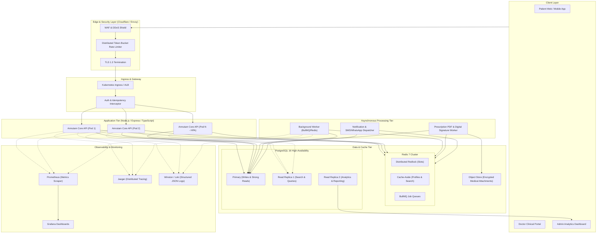
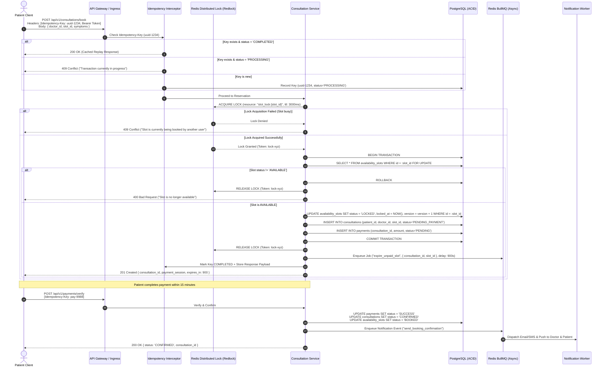
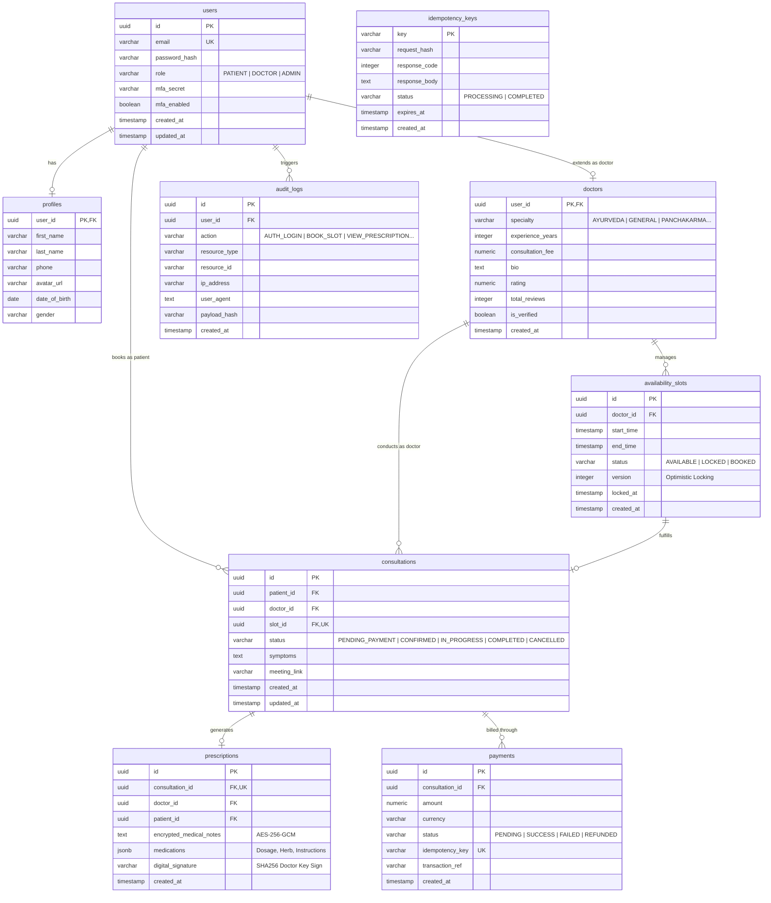
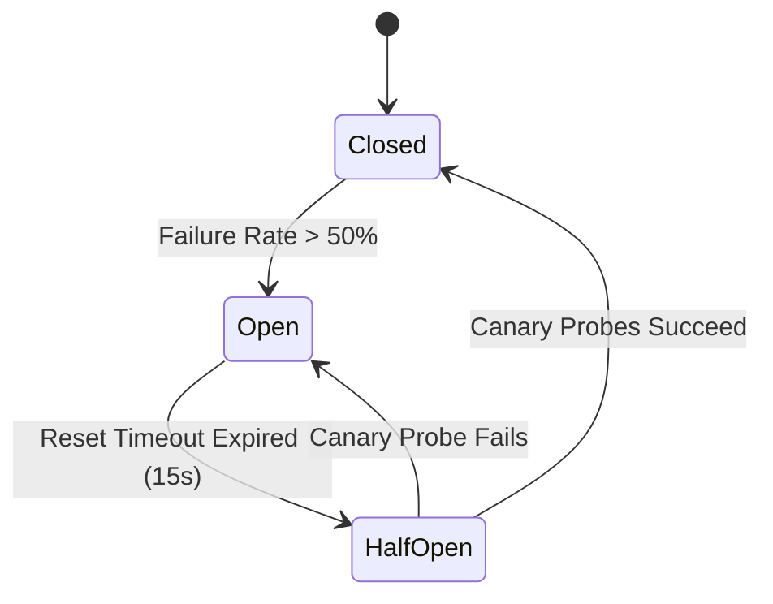
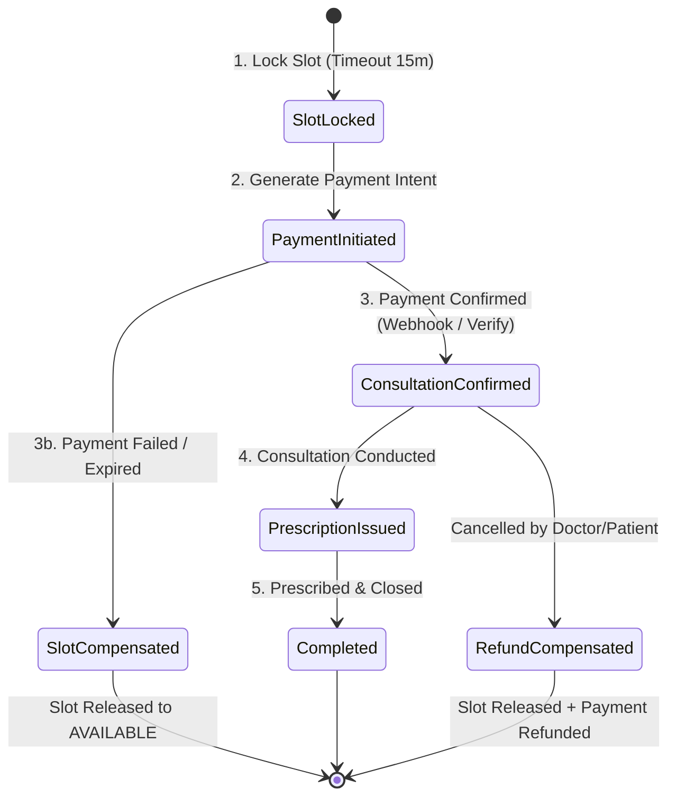

# Amrutam Telemedicine Backend — Architecture & System Design Document

**System Target Scale**: 100,000 daily consultations  
**Target Latency**: p95 < 200ms reads, p95 < 500ms writes  
**Availability SLA**: 99.95% uptime  
**Compliance Standard**: HIPAA, DISHA, OWASP Top 10, ISO 27001 aligned  

---

## 1. High-Level Architecture & Data Flow

Amrutam’s telemedicine platform leverages a high-throughput, horizontally scalable, multi-tier micro-modular architecture. The system is designed to handle bursty consultation traffic during peak morning and evening consultation hours.

### 1.1 Architecture Diagram



### 1.2 Data Flow Lifecycle
1. **Request Ingestion**: Incoming traffic hits Cloudflare/WAF for TLS termination, DDoS mitigation, and global IP rate limiting.
2. **Gateway Interception**:
   - Extract JWT, validate signature, check token revocation cache in Redis.
   - If writing (POST/PUT/PATCH), inspect `Idempotency-Key` header against the Idempotency Store.
3. **Core Processing**:
   - Stateless Node.js microservices execute domain logic via Clean Layered Architecture (Controller -> Service -> Repository).
   - Write operations acquire distributed Redlocks when modifying shared resources (e.g. `availability_slots`).
4. **Data Persistence**:
   - Primary PostgreSQL handles ACID transactions for bookings, payments, and prescription records.
   - Read queries (such as doctor search and directory listing) route to read replicas.
5. **Asynchronous Hand-off**:
   - Heavy tasks (digital signature generation, PDF rendering, email/SMS dispatch, payment settlement verification) are pushed to Redis-backed message queues.
6. **Observability Emission**:
   - Every request is tagged with a unique `X-Correlation-ID` and OpenTelemetry span, exported to Prometheus and Jaeger.

---

## 2. Booking Flow Sequence Diagram

The booking flow must handle high concurrency when multiple patients simultaneously attempt to reserve the same doctor slot. The sequence utilizes distributed locks in Redis coupled with optimistic database locking.



---

## 3. Entity-Relationship (ER) Diagram



---

## 4. API Schema & Endpoint Architecture

The system provides RESTful JSON APIs structured under `/api/v1`, accompanied by interactive Swagger/OpenAPI documentation at `/api/docs`.

| Method | Endpoint | Description | Auth & Roles | Idempotency |
|---|---|---|---|---|
| `POST` | `/api/v1/auth/register` | Register new user | Public | No |
| `POST` | `/api/v1/auth/login` | User login (returns JWT + MFA status) | Public | No |
| `POST` | `/api/v1/auth/mfa/setup` | Generate TOTP secret & QR code | Bearer (All) | No |
| `POST` | `/api/v1/auth/mfa/verify` | Verify TOTP code and enable MFA | Bearer (All) | No |
| `POST` | `/api/v1/auth/refresh` | Rotate access token via refresh token | Bearer (Refresh) | No |
| `GET` | `/api/v1/doctors` | Search & filter doctors | Public / Cached | No |
| `GET` | `/api/v1/doctors/:id` | Get detailed doctor profile | Public / Cached | No |
| `POST` | `/api/v1/doctors/slots` | Create availability slots | Bearer (Doctor) | Yes |
| `GET` | `/api/v1/doctors/:id/slots` | Get available slots for a doctor | Public / Cached | No |
| `POST` | `/api/v1/consultations/book` | Reserve slot & initiate consultation | Bearer (Patient) | **Required** |
| `POST` | `/api/v1/consultations/:id/cancel` | Cancel booking & trigger refund | Bearer (Patient/Doctor) | **Required** |
| `POST` | `/api/v1/payments/verify` | Simulate payment capture & confirm slot | Bearer (Patient) | **Required** |
| `POST` | `/api/v1/prescriptions` | Issue encrypted prescription | Bearer (Doctor) | **Required** |
| `GET` | `/api/v1/prescriptions/:consultationId` | View decrypted prescription | Bearer (Patient/Doctor)| No |
| `GET` | `/api/v1/admin/analytics` | Consultation metrics, revenue, SLA | Bearer (Admin) | No |
| `GET` | `/api/v1/audit/logs` | Query audit trail for compliance | Bearer (Admin) | No |
| `GET` | `/health/live` | Kubernetes Liveness Probe | Public | No |
| `GET` | `/health/ready` | Kubernetes Readiness Probe (DB/Redis) | Public | No |
| `GET` | `/metrics` | Prometheus Metrics Scrape Endpoint | Internal / Scraper| No |

---

## 5. Retry & Backoff Strategies

To handle transient network hiccups, 3rd-party payment gateway dropouts, and external SMS/Email provider failures, the system applies **Exponential Backoff with Full Jitter**.

### 5.1 Mathematical Model
$$T_{backoff} = \min(T_{max}, T_{base} \times 2^{attempt}) + \text{random}(0, \text{jitter})$$
- $T_{base} = 500\text{ ms}$
- $T_{max} = 30\text{ seconds}$
- Maximum Retries: 5 attempts
- Jitter prevents "thundering herd" spikes against dependent services.

### 5.2 Circuit Breaker Integration
For external payment gateways and notification providers:
- **Closed State**: Normal operations.
- **Open State**: Triggered if error rate exceeds 50% over a 20-second rolling window. Fast fails requests immediately with fallback error.
- **Half-Open State**: After 15 seconds, permits 3 canary probe requests. If successful, resets to Closed; if failing, re-opens.



---

## 6. Data Partitioning & Scalability Strategy (100k Consultations / Day)

### 6.1 Capacity Sizing Calculation
- 100,000 daily consultations $\approx 3,000,000$ consultations/month $\approx 36,500,000$/year.
- Average consultation record payload: ~2 KB.
- Yearly primary table growth: $\sim 73\text{ GB}$ (metadata) + audit logs ($\sim 250\text{ GB}$).
- Peak throughput: 100,000 consultations over 12 peak hours $\approx 2.3$ bookings/sec average, with burst peaks of $150\text{ bookings/sec}$ during holiday / clinic promotion campaigns.

### 6.2 Partitioning Strategy
1. **Range Partitioning by Month** for high-volume time-series tables:
   - `consultations` partitioned by `created_at` (e.g., `consultations_2026_09`, `consultations_2026_10`).
   - `audit_logs` partitioned by `created_at` monthly. Partitions older than 2 years are archived to cold parquet storage (S3/Glacier) for statutory HIPAA compliance.
2. **Hash Partitioning** for user profiles and slots:
   - Partitioned across 8 shard buckets on `doctor_id` / `patient_id` when scaling beyond 10 million active users.
3. **Read/Write Splitting**:
   - Primary DB handles write transactions.
   - Read replicas handle doctor search, slot viewing, and admin analytics queries with connection pooling (PgBouncer).

---

## 7. Caching and Concurrency Handling

### 7.1 Multi-Tier Caching
1. **L1 Application Cache**: High-frequency configuration, doctor specialization lists (TTL: 1 hour).
2. **L2 Distributed Redis Cache**:
   - `doctor:{id}` profile data (TTL: 15 minutes, Cache-Aside pattern).
   - `search:specialty:{name}` top doctors list (TTL: 5 minutes, invalidated when doctor rating or fee changes).
   - Slot availability: Cached with short TTL (30s) and proactively invalidated upon booking or cancellation.

### 7.2 Concurrency & Double-Booking Elimination
Double booking is prohibited in telemedicine. Two concurrent requests for the same slot are resolved using a **dual-layer protection**:

1. **Redis Redlock (Layer 1 - Edge Protection)**:
   - Atomic acquisition with `SET slot_lock:{slot_id} {uuid} NX PX 3000`.
   - Only 1 worker proceeds; the competing worker immediately receives `409 Conflict`.
2. **PostgreSQL Optimistic Version Check (Layer 2 - Persistence Guard)**:
   ```sql
   UPDATE availability_slots
   SET status = 'LOCKED', version = version + 1, locked_at = NOW()
   WHERE id = $1 AND status = 'AVAILABLE' AND version = $2;
   ```
   If affected rows = 0, transaction aborts, guaranteeing zero race conditions even under network partitions.

---

## 8. Transaction Management & Sagas (Distributed Transactions)

A consultation booking involves cross-boundary actions:
1. Slot lock in Availability Service.
2. Consultation entity creation in Booking Service.
3. Payment pre-authorization in Payment Gateway.
4. Notification dispatch in Communications Service.

We implement an **Orchestration-Based Saga Pattern**:



- **Compensating Actions**:
  - If payment authorization fails: Compensation job releases `availability_slots` back to `AVAILABLE`.
  - If patient cancels 2 hours before slot: Automatic trigger calls payment refund API, marks slot as `AVAILABLE`, and sends cancellation notices.

---

## 9. Backup and Disaster Recovery (DR) Strategy

### 9.1 Recovery Objectives
- **RPO (Recovery Point Objective)**: $< 1\text{ minute}$ (zero data loss for confirmed consultations).
- **RTO (Recovery Time Objective)**: $< 15\text{ minutes}$ for failover to secondary cloud region.

### 9.2 DR Topology & Implementation
- **PostgreSQL Continuous WAL Archiving**:
  - Write-Ahead Logs (WAL) streamed continuously to AWS S3 / GCS multi-region bucket using `pgBackRest` / `WAL-G`.
  - Full snapshots taken daily at 02:00 UTC; differential snapshots taken every 4 hours.
- **Multi-AZ Synchronous Replication**:
  - Standby PostgreSQL replica running in a separate Availability Zone with automated failover via Patroni / AWS RDS Multi-AZ.
- **Redis High Availability**:
  - Redis Sentinel / Redis Cluster with 3 master and 3 replica nodes across 3 availability zones.
- **Drill & Verification**:
  - Bi-weekly automated restoration drill into an isolated staging sandbox verifying database integrity checksums.
